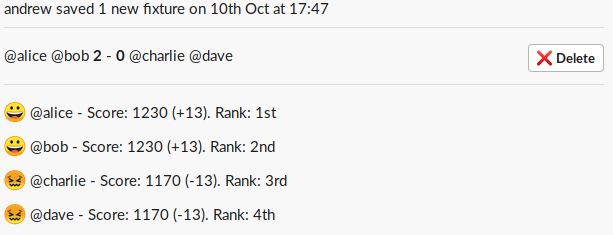
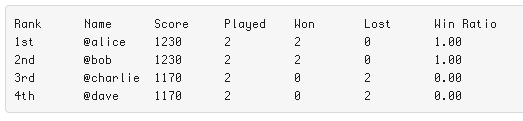
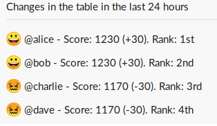
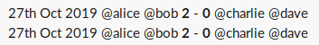
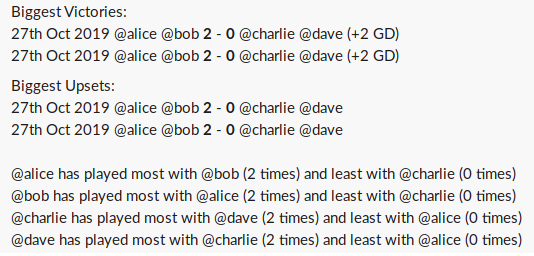
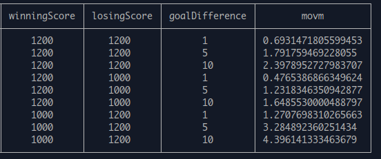

# Rocket League Slack Bot

Track Rocket League scores and view Elo rankings within Slack.

## Commands

### Record a result

Record the outcome of a game, which is saved to the database.

`/rocket-record @alice @bob 2 0 @charlie @dave`



The changes to players' Elo scores and ranks are shown. If a game is deleted, a message is posted to the channel saying so, including who deleted it.

### Show the league table

Shows the league table of players and some statistics.

`/rocket-table`



### Show changes in the table

Show score and rank changes in the last 24 hours.

`/rocket-changes`



### Show history

Shows all games in the database ordered by time.

`/rocket-history`



### Show stats

Shows some stats on the biggest victories and upsets, and who people tend to team up with (and not team up with).

`/rocket-stats`



## Hidden Features

Some other features can only be activated at present by editing the SQLite database or setting environment variables.

### Hiding players

Players can be hidden from the league table. Their games will still contribute towards the Elo history.

```sql
UPDATE players SET hidden = TRUE WHERE name = 'charlie';
```

### Player Emoji

Custom win and lose emoji can be set by setting the `win_emoji` and `lose_emoji` in the database.

```sql
UPDATE players SET win_emoji = 'champagne', lose_emoji = 'neutral_face' WHERE name = 'bob';
```

### Limit recording games to one channel

Set the `SLACK_HOME_CHANNEL` environment variable.

E.g. If you set `SLACK_HOME_CHANNEL=general` then try to record a game in the #random channel: `Sorry, you can only record games in the #general channel.`

## Notes on Elo scoring

Rocket League is normally a team-based game. To attain Elo rankings for individuals based on the outcomes of team games, we consider each team as a unit when computing Elo updates. This should give a fair representation of individual skill over the longer term provided that players choose random teams.

Games' contribution to player score decays over time. By default, games decay linearly over a period of 3 months. After that point, the game will have no impact on the scores of the players involved.

There is a margin of victory multiplier (MoVM), here are some examples of typical multipliers:



## References

The following articles were referred to when building the project.

- https://blog.mackie.io/the-elo-algorithm
- https://ryanmadden.net/posts/Adapting-Elo

## How to build it

Coming soon

## How to use it

Coming soon
